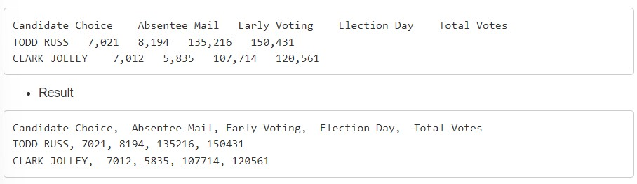
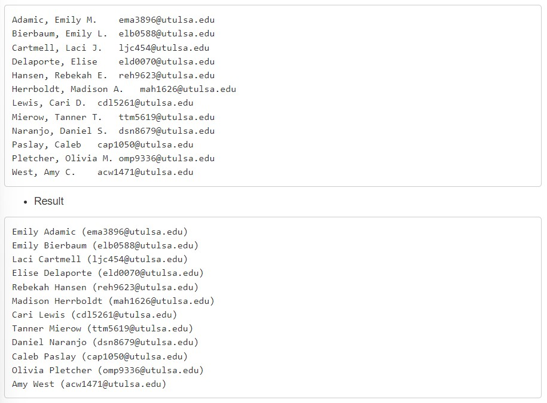
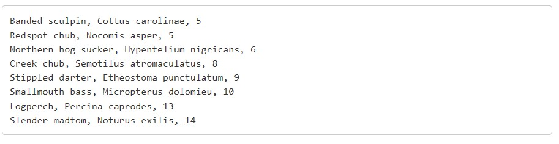
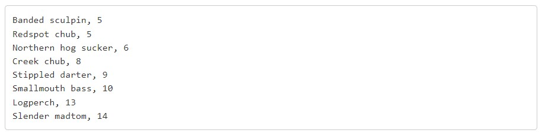
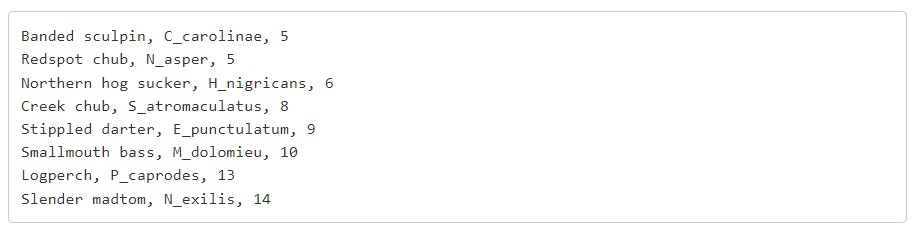
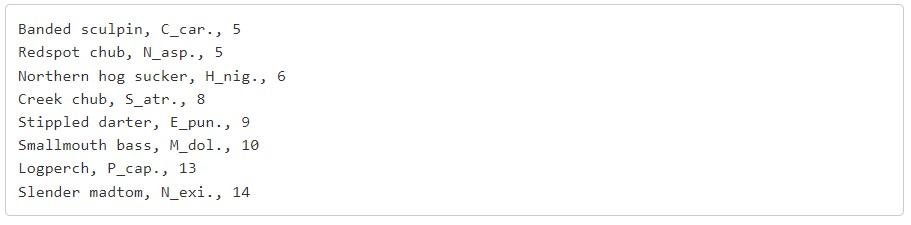
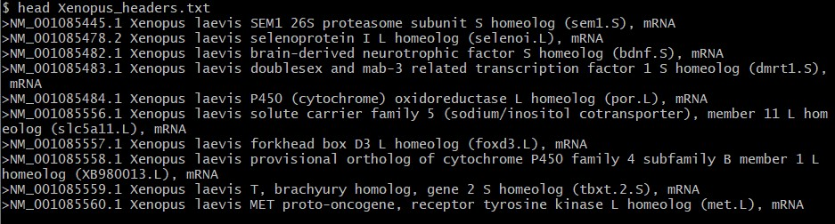
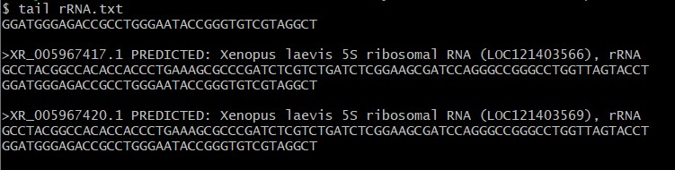

## Question 1
#### Convert this table from a pdf into a csv format using regular expression in Notepad++  
  

#### Answer 1: 
``1. Find comma "," and replace with "nothing" ``

`` 2. Find \s{3,5} and replace with comma space ", " ``  

##### Explanation: The first step finds areas with a comma and deletes it. Then you find areas with 3 to 5 spaces and replace that with a comma and a space after.

## Question 2
#### Reformat the class roster
###### Note: make sure to line break after the last person, Amy West

#### Answer 2:  

`` 1. Find \s\w.\s and replace with two spaces "  " ``  
`` 2. Find (\w+), (\w+) and replace with (\2 \1) ``   
`` 3. Find (\w+\d) and replace with \(\1) ``  
`` 4. Find (\w{3})(/r) and replace with (\1\)``   
`` 5. Find \s{2,} and replace with a single space " "``  

##### Explanation: The first step finds an area within the text that has a space followed by a letter, period, and a space. The only area are the initials of the middle name. I replaced it with two spaces to keep the first name and email address far a part. Then I found areas with a word with more than one consecutive letters followed by a comma and another word with more than one consecutive letters and replaced it with (\2 \1). This switches those two elements and gets rid of the comma. For the third step I found areas with more than one consecutive letter that is followed by numbers and replaced it with the first element (the letters) to have parenthesis. For the fourth step find a place with 3 letters followed by a line break. The only place is the .edu and replace with a parenthesis after element 1. Lastly, find areas with more than two spaces and replace with a single space.

## Question 3 
#### Use regular expressions to drop the genus species name

#### Answer 3:  
`` 1. Find , \w+ \w+ and replace with "nothing" ``  

##### Explanation: Find an area with a comma followed by two words that both have more than one consecutive letters. This will find the scientific name and replace it with nothing. 

## Question 4
#### With the original set above, use regular expression to modify the names as such

#### Answer 4:  
``1. Find , (\w)\w{5,}"space" and replace with , \1_\2 ``  

##### Explanation: Find an area of text that has a comma, space, and the first letter of the word, followed by a word that has at least 5 or more letters. Then replace with the first element (one letter) followed by an underscore and the second element (species name).

## Question 5  
#### Again with the original data set, abbreviate the genus species as listed below

#### Answer:  
`` 1. Find , (\w)\w{5,}"space" and replace with , \1_\2 ``  
`` 2. Find (\w_)(\w{3})(\w+) and replace with \1\2. ``  

##### Explanation: I used the first step from the question above. Then I find the text that has a letter followed by a underscore then the next word only has three letters (the shortened species epithet) and the last part picks up the rest of the species name. I replace it with element 1 (genus first letter and the underscore) and element 2 (three letters of the species epithet) followed by a period to abbreviate.

## Question 6
#### Create a new file with GitBash that only contains the fasta headers from the original transcriptome file

`` 1. Downloaded Xenopus laevis file from NCBI ``  
`` 2. used the command: grep '^>' rna.fna > Xenopus_headers.txt ``

##### Explanation: I used the grep command that prints lines matching a pattern. Then you use ``>`` so grep prints the lines that start with ``>``. The ``^`` regular expression specifies that is it the start of a line. Those results are then printed into a new file called Xenopus_headers.txt. Above shows the beginning of the txt file.

## Question 7
#### Create a new file that contains the full sequences of only the ribosomal transcripts

`` 1. sed 's/>/ \n>/g' rna.fna | sed -n '/rRNA/,/^ /p' > rRNA.txt ``

##### Explanation: The sed command can also search the full sequence of a transcript of choice (rRNA/ribosomal). This command selects the lines containing the word "rRNA". The use of ``s'`` and ``g'`` in the sed command replaces all occurrences of the string in the line. Then the pipe passes the output from the 'rna.fna' file to the second command, with the ``-n`` option and the ``/p`` print flag, which displays the printed lines only once that include rRNA. Then this new information is printed in a new file called rRNA.txt.