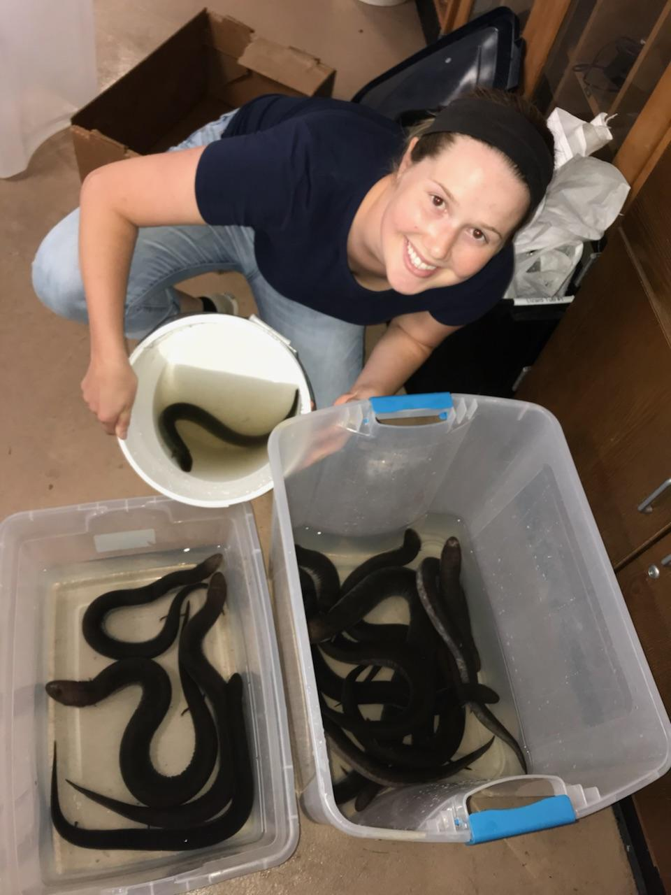

### **About myself**
My name is Emily Bierbaum, and I am starting my 3rd year as a PhD students in Dr. Bonett's lab studying salamanders. Outside of school, I enjoy playing soccer and going herping.

### **Research Experience**
I began my academic career as a double major student in biology and animal ecology at Iowa State University studying the population dynamics of leopard frogs. I then attended Southeastern Louisiana University and completed my master's degree researching the homology of mesopodial skeletal elements and digit number in salamanders, and the comparison to amphiumid salamanders. I am now a PhD student at the University of Tulsa evaluating visual pigments across salamanders, with a focus on the genus *Eurycea*. 

### **Research Interest**  
**Emily L. Bierbaum ResearchGate**  
[Emily Bierbaum profile](https://www.researchgate.net/profile/Emily-Bierbaum)  
**Access to Dr. Bonett's website** ``PhD advisor``   
[Ron Bonett's Lab](https://ronbonett.weebly.com/people.html)   
**Access to Dr. Beachy's website** ``Masters advisor``   
[Chris Beachy's Lab](http://www.amphibiangrowthproject.org/who-we-are)  

**Pictured at SELU handling my research species, *Amphiuma tridactylum* **

{width=50%}

### **Assignments**
| Date | Descriptive Name | Assignment Link |
| :----- | :-----| :-----|
| 9/8/2022 | Introduction to Git | [Assignment 1](https://emilybierbaum.github.io/BierbaumBIOL7263/Assignment1.html)
| 9/15/2022 | Rmarkdown Webpage | [Assignment 2](https://emilybierbaum.github.io/BierbaumBIOL7263/) |
| 9/22/2022 | Regular Expression and BashShell intro | [Assignment 3](Assignment3.html)
| 9/29/2022 | dplyr exercises | [Assignment 4](Assn_4.html) 

